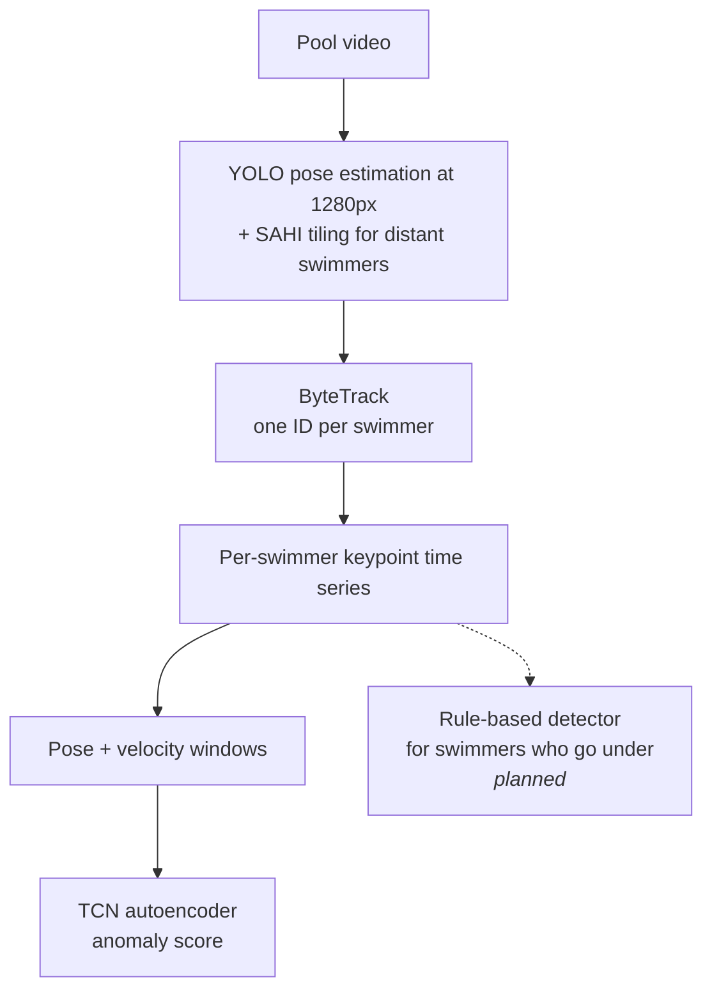

# Hydro-Knight

[](https://github.com/nickpearlstone/Hydro-Knight/actions/workflows/ci.yml)

Hydro-Knight is a computer vision project that watches swimming pool footage and
flags swimmers who may be drowning. It tracks each swimmer, turns their body pose
into a time series, and looks for patterns that match real drowning behavior.

It is built around what I learned as a lifeguard: most drownings are quiet. There
is usually no splashing or yelling. A swimmer slips under and doesn't come back up.
A useful detector has to notice when someone disappears, in addition to spotting
dramatic movement.

This is a learning and portfolio project, still in active development.

## How it works



The model is an **anomaly detector**. It learns what normal swimming looks like and
scores how far a swimmer strays from it. Real drowning footage is rare, so training
a classifier on labeled examples of each type isn't practical. The system is also
tuned to favor recall, because a missed drowning costs far more than a false alarm.

## Five ways drowning shows up on camera

| Signature | What the camera sees | Planned detection |
|---|---|---|
| Silent sink | A swimmer goes under mid-pool and never resurfaces | Per-swimmer timer |
| Bobbing in place | Repeated up-and-down cycles with no forward movement | Per-swimmer rules |
| Passive face-down | A still, face-down body for too long | Pose + duration rules |
| Flailing | Erratic, high-energy arm and leg movement | Autoencoder |
| Effort without progress | Swimming hard without moving through the water | Displacement features |

Only flailing is a good fit for an autoencoder. The other four depend on timing and
position, so they will be handled by explicit rules over each swimmer's track.

## Key findings so far

Full writeups, figures, and numbers are in [docs/FINDINGS.md](docs/FINDINGS.md).

**1. Image resolution mattered more than model choice.** YOLO-pose found far more
swimmers than MediaPipe on crowded scenes. Raising YOLO's input size from 640px to
1280px found 3 to 6 times more swimmers on the same frames.


*Figures are pixelated on purpose. Pool footage often shows minors, so only the
detected skeletons are drawn clearly.*

**2. Tiling and a dedicated tracker made distant swimmers usable.** Splitting each
frame into overlapping tiles (SAHI) raised detections from about 13 to about 50
swimmers per frame on a crowded clip. ByteTrack then turned those detections into
15 stable swimmer IDs, down from 53 unstable ones with a simple tracker.

**3. The first trained model scored at chance, and the reason changed the plan.**
The first full training run of the temporal autoencoder scored a ROC-AUC of 0.539,
which is about the same as guessing. Tracing the data showed the problem was in the
input features, and more training would not have fixed it:

- When a swimmer goes under, pose confidence drops and those frames get filtered out.
  The moments that matter most never reach the model.
- A still, face-down body is easy to reconstruct, so it looks *more* normal to the
  model.
- Poses are centered on each swimmer's hips, which hides whether they are actually
  moving through the water.

This result is a baseline. The feature pipeline, labeling, and detectors are all
being reworked based on it, and later results will be reported the same way.

## Project status

**Built and tested**
- Data pipeline: a JSONL manifest of source clips, a download tool, and a browser
  labeling app for marking each rescue's timeline and where the victim is
- Pose extraction with YOLO11-pose, SAHI tiling, and ByteTrack
- Features: hip-centered, torso-scaled poses plus joint and body velocity (70 values
  per frame)
- A temporal convolutional (TCN) autoencoder
- An evaluation harness that works with any detector. It reports per-event recall,
  how quickly each event is caught, false alarms per hour, ROC/PR curves, and how much
  pose data survives inside each event
- MLflow experiment tracking, and CI running pytest plus ruff lint and format checks

**Dataset:** 74 clips (66 rescues, 4 normal, 4 unlabeled). An audit found 10 rescue
clips produced no keypoints during extraction, so roughly 30% of positive examples
currently need work.

**In progress / next**
1. Re-extracting the full dataset with a new two-step pipeline: tiled detection saved
   raw on the GPU, then merging and tracking on CPU, so tracking fixes never need
   another GPU pass
2. A controlled comparison of the model with and without velocity features
3. A rule-based detector for swimmers who go under and don't resurface
4. Keeping partial poses instead of dropping them, and labeling windows by swimmer
   instead of by time range

## Quickstart

Requires Python 3.11+ and [uv](https://docs.astral.sh/uv/).

```bash
uv sync                          # install dependencies
uv run python -m pytest          # run the tests
uv sync --extra tracking         # optional: MLflow
uv sync --extra spike            # optional: MediaPipe, to regenerate the comparison figures
```

Pose extraction and training run on a Colab GPU. See
[docs/COLAB_TRAINING.md](docs/COLAB_TRAINING.md). The evaluation report is generated
with `scripts/eval_report.py`.

## Data and privacy

No video is stored in this repo. It holds a manifest of source links, metadata, and
labeled event time windows. Publicly posted footage isn't licensed for
redistribution, and it shows identifiable people, often children. Labels are based
on outcomes: if a lifeguard stepped in, the clip counts as a distress event. More in
[docs/DATA_SOURCING.md](docs/DATA_SOURCING.md).

## License

[AGPL-3.0](LICENSE), inherited from the pose backend,
[Ultralytics YOLO](https://github.com/ultralytics/ultralytics).
